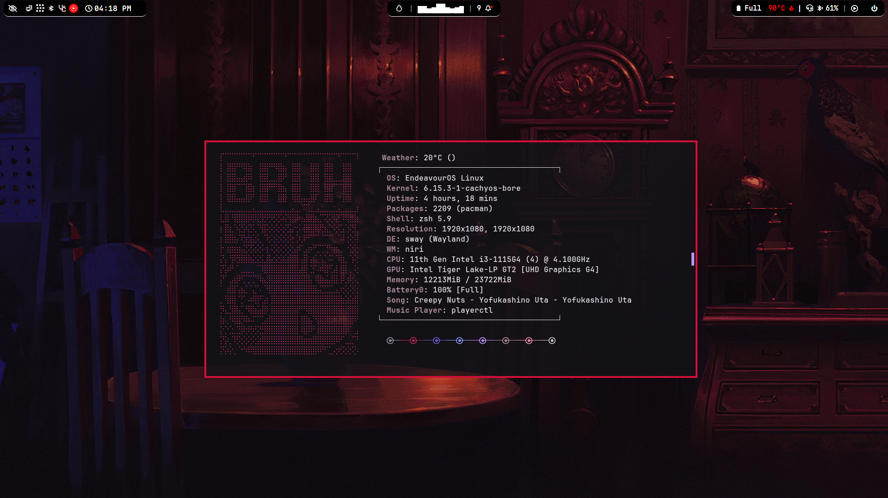
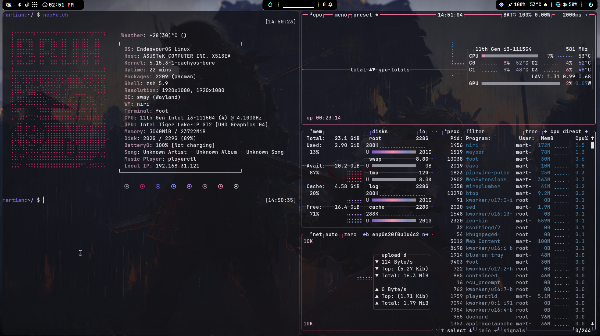
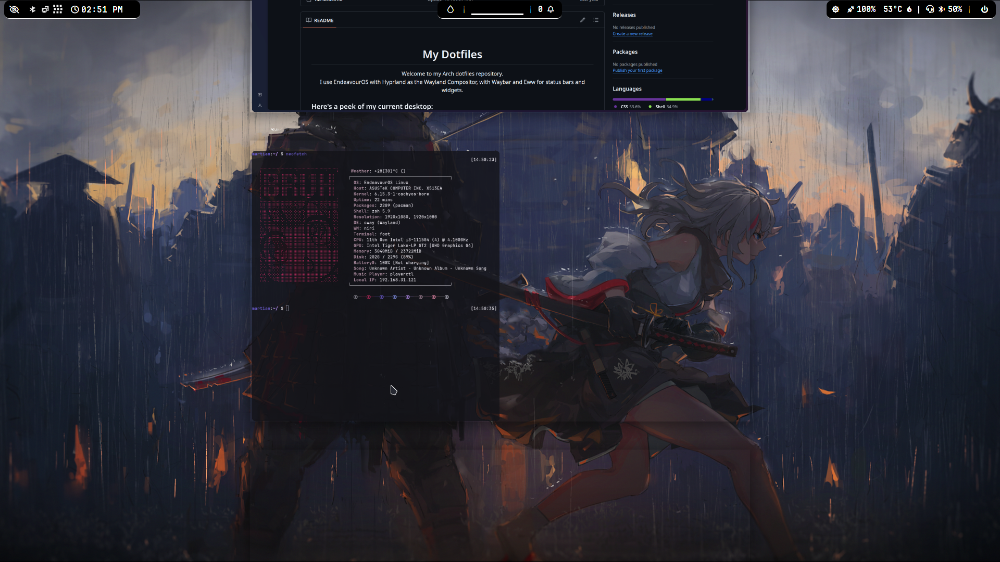
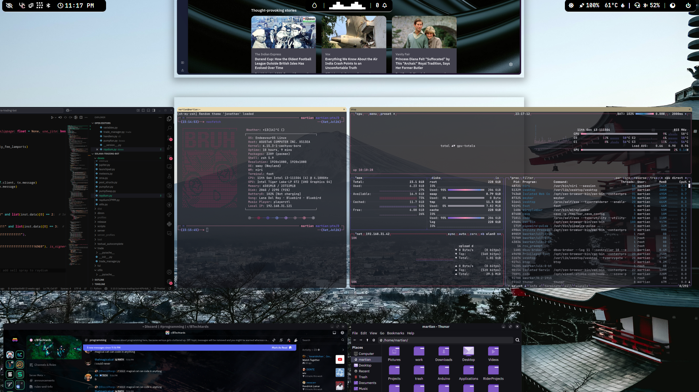

<div align="center"><h1>My Dotfiles</h1>

Welcome to my dotfiles repository.<br/>
I use EndeavourOS with Niri as the Wayland Compositor, with Waybar and rofi for status bars and widgets.
</div>

### Here's my current niri setup





### Here's a peek of my old hyprland desktop:


### And here's the old KDE Plasma desktop:


## What's Inside

- **Wayland Compositor**: Niri
- **Display Server**: Wayland
- **Multiplexor**: Zellij
- **Terminal**: Foot.
- **Dock**: Waybar.
- **Editor**: NeoVim, Zed, Code.

## Make It Your Own

Feel free to explore and adapt these dotfiles to suit your preferences. Please, do not just smash the configs into `~/.config`. Just follow these steps:

1. Clone the repository.
2. Customize the configuration files.
3. Copy or replace these with the defaults in ```$HOME/.config/```
